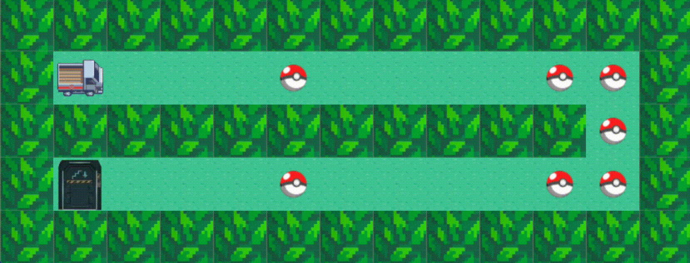
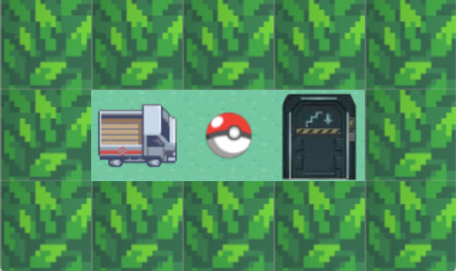
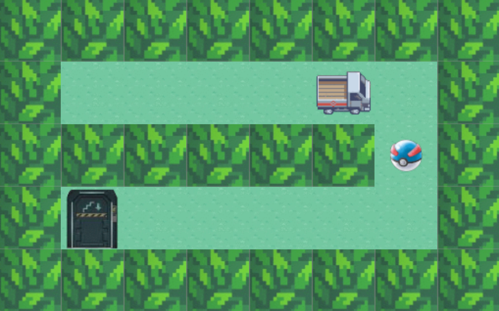
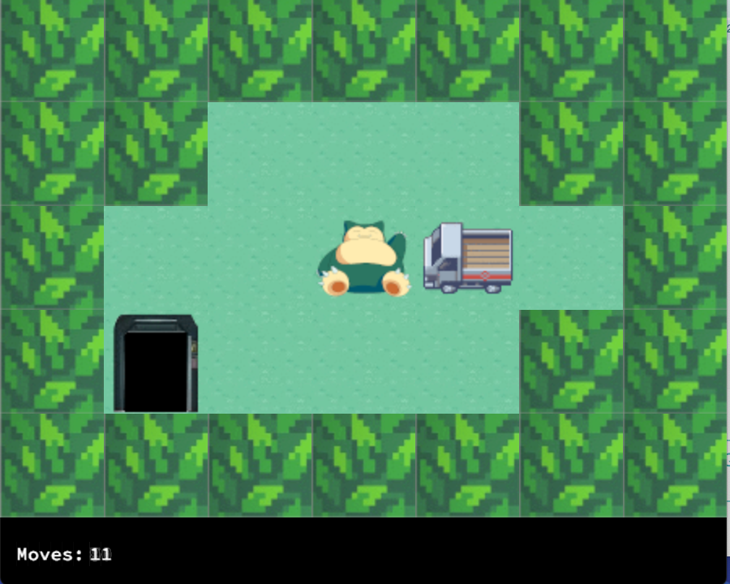

# :video_game:  SO_LONG [:es:]

#### Resumen
> Este proyecto es un pequeño juego 2D con la minilibx. Aprenderás sobre texturas, sprites y tiles. 

### Preview Gift
  

### INFO

|   Keywords   |           Skills          |
|--------------|:-------------------------:|
| Applicative  |   Imperative programming  |
|              |          Graphics         |

### ESTADO
#### in progress

<!--  -->

#### CLONAR REPOSITORIO
~~~~~
git clone https://github.com/victorFernandezF/So_long-42.git
~~~~~

### ALGUNAS IMÁGENES

# :video_game:  SO_LONG [:gb:]

#### Summary
> This project is a small 2D game with minilibx. You'll learn about textures, sprites and tiles.

### Imagen

### INFO

|   Keywords   |           Skills          |
|--------------|:-------------------------:|
| Applicative  |   Imperative programming  |
|              |          Graphics         |

### STATUS
#### In Progress

<!--  -->

#### CLONE REPO
~~~~~
git clone https://github.com/victorFernandezF/So_long-42.git
~~~~~

### SOME IMAGES

